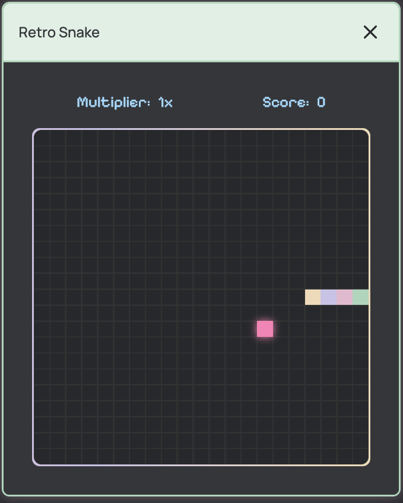
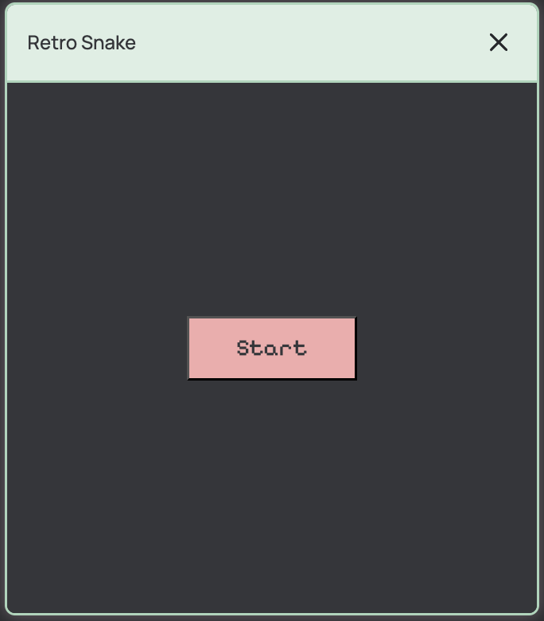
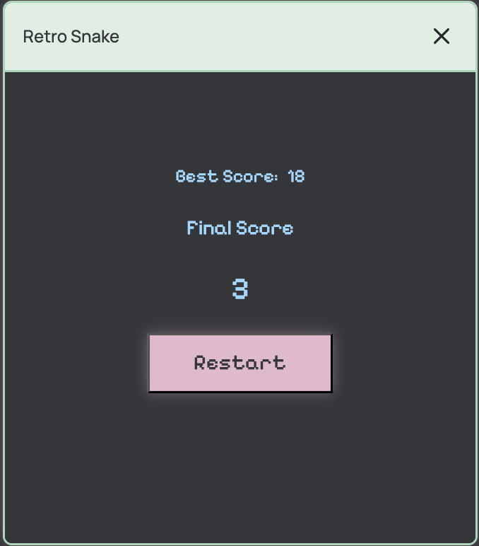

# Snake Game 🐍

Built to practice **state management, game logic, and Canvas API rendering**.

This project demonstrates working with **React state management, Canvas rendering, and basic game logic architecture**.

---

## Features

- keyboard controls (arrow keys)
- dynamic speed increase
- score and best score tracking (localStorage)
- snake self-collision detection
- game loop based on setInterval
- canvas-based rendering
- animated game frame
- responsive canvas rendering

---

## Gameplay



---

## Start Screen



---

## Game Over Screen



---

## Tech Stack

- React (useReducer, hooks)
- Canvas API
- Vite
- CSS (animations, gradients)

---

## Getting Started

Clone the repository and install dependencies:

```bash
git clone https://github.com/shabal1nas/snake-game
cd snake-game
npm install
npm run dev
```

---

## Build

Create a production build:

```bash
npm run build
```

## Live Demo

[Open the game](https://shabal1nas.github.io/snake-game/)

## Controls

| Key | Action     |
| --- | ---------- |
| ↑   | Move Up    |
| ↓   | Move Down  |
| ←   | Move Left  |
| →   | Move Right |

---

## Author

Created as a learning project while studying **React and game logic architecture**.

---

## 🇷🇺 О проекте (на русском)

Классическая игра «Змейка», реализованная с использованием **React**, **Canvas API** и **Vite**.

В проекте реализованы:

- управление с клавиатуры
- динамическое увеличение скорости
- система очков и сохранение лучшего результата (localStorage)
- проверка столкновений (стены и тело змейки)
- отрисовка через Canvas API
- анимация рамки игрового поля

Проект выполнен с упором на:

- управление состоянием (useReducer)
- построение игровой логики
- работу с Canvas API